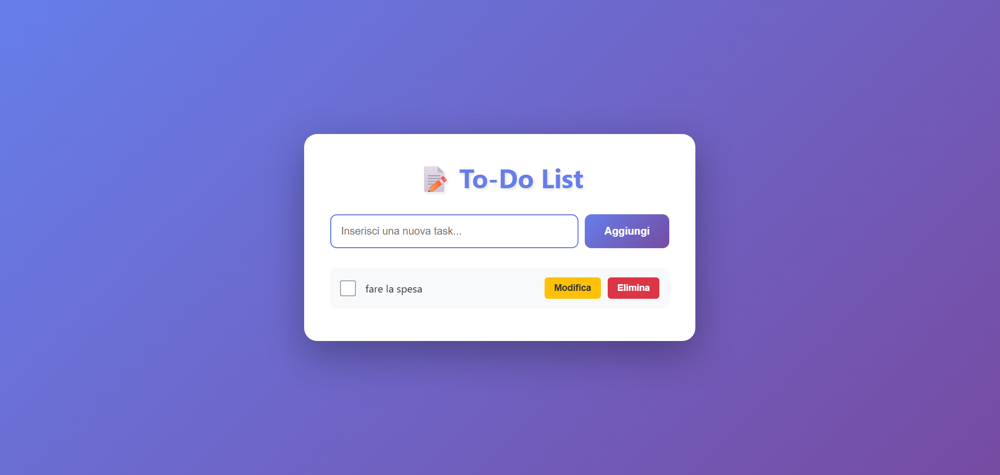
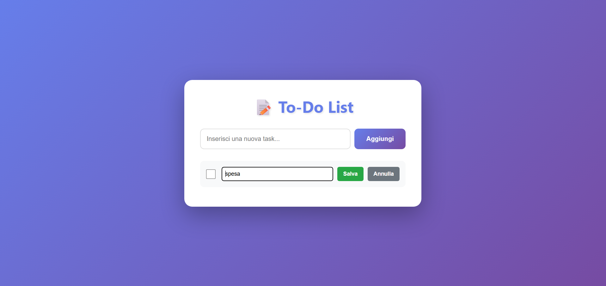

# To-Do List Application

Una semplice e moderna applicazione To-Do List con backend Flask e interfaccia web responsive.





## Caratteristiche

- ✅ Aggiungere nuove task
- ✅ Eliminare task esistenti
- ✅ Modificare task
- ✅ Segnare task come completate
- ✅ Persistenza dei dati con database SQLite
- ✅ Interfaccia web moderna e responsive

## Installazione

1. Installa le dipendenze:
```bash
pip install -r requirements.txt
```

## Avvio dell'applicazione

1. Attiva l'ambiente virtuale:
```bash
.\.venv\Scripts\Activate.ps1
```

2. Avvia il server Flask:
```bash
python app.py
```

3. Apri il browser e vai su:
```
http://localhost:5000
```

> **Nota:** Assicurati di aver installato le dipendenze con `pip install -r requirements.txt` prima di avviare l'applicazione.

## Utilizzo

- **Aggiungere una task**: Scrivi il testo nel campo di input e clicca "Aggiungi" o premi Enter
- **Completare una task**: Clicca sulla checkbox accanto alla task
- **Modificare una task**: Clicca sul pulsante "Modifica", modifica il testo e clicca "Salva"
- **Eliminare una task**: Clicca sul pulsante "Elimina" e conferma

## Struttura del progetto

```
Todo python/
├── app.py              # File principale dell'applicazione Flask
├── run.py              # Script per avviare il server
├── config.py           # Configurazioni dell'applicazione
├── database.py         # Gestione del database SQLite
├── routes.py           # Definizione delle route API
├── __init__.py         # Inizializzazione del package
├── templates/
│   └── index.html      # Frontend con HTML/CSS/JS
├── requirements.txt    # Dipendenze Python
├── .gitignore          # File da ignorare in Git
├── tasks.db            # Database SQLite (generato automaticamente)
└── README.md           # Questo file
```

## API Endpoints

- `GET /api/tasks` - Ottieni tutte le task
- `POST /api/tasks` - Aggiungi una nuova task
- `PUT /api/tasks/<id>` - Aggiorna una task
- `DELETE /api/tasks/<id>` - Elimina una task
